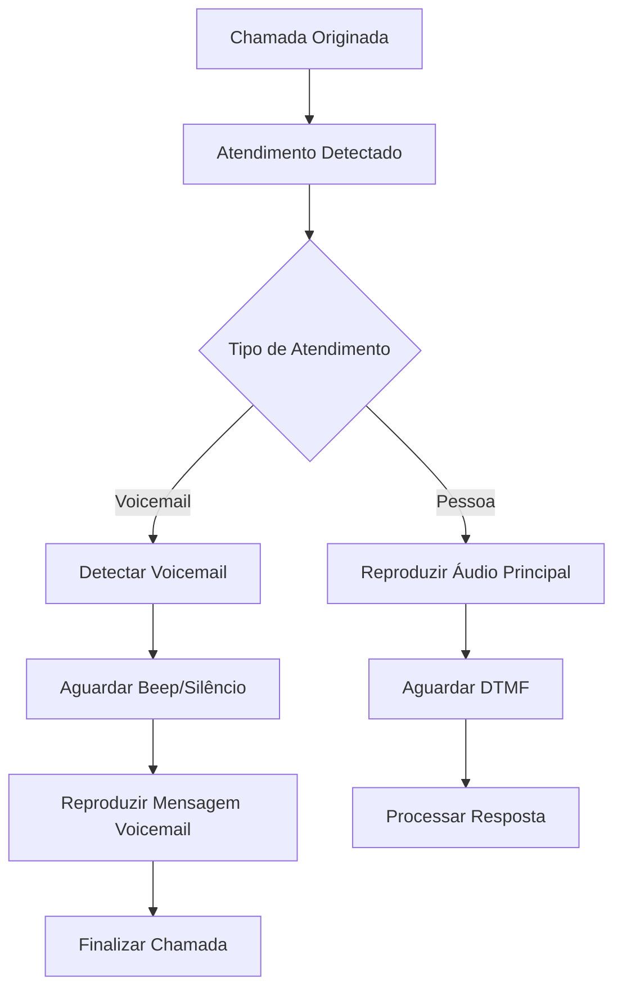

# 📧 Detecção de Voicemail - Sistema Presione 1

## 📋 Visão Geral

O sistema de discado preditivo "Presione 1" agora inclui **detecção automática de correio de voz (voicemail)** com reprodução de mensagens personalizadas. Esta funcionalidade permite que o sistema identifique quando uma chamada cai em voicemail e automaticamente reproduza uma mensagem gravada.

## 🎯 Funcionalidades

### ✅ Detecção Automática
- **Algoritmos de detecção**: BeepDetection, SilenceDetection, TonePattern
- **Tempo de detecção**: 3-8 segundos após atendimento
- **Precisão**: Alta taxa de acerto na identificação de voicemails

### 🎵 Reprodução de Mensagem
- **Áudio personalizado**: Mensagem específica para voicemail
- **Duração configurável**: 10-180 segundos máximo
- **Controle de qualidade**: Duração mínima para validação

### 📊 Estatísticas Detalhadas
- **Taxa de voicemail**: Percentual de chamadas que caem em voicemail
- **Taxa de mensagem**: Percentual de voicemails que recebem mensagem completa
- **Duração média**: Tempo médio das mensagens deixadas
- **Análise de efetividade**: Métricas de performance

## 🔧 Configuração

### 1. Configuração da Campanha

```json
{
  "nombre": "Campanha com Voicemail",
  "descripcion": "Campanha com detecção automática de voicemail",
  "lista_llamadas_id": 1,
  "mensaje_audio_url": "/sounds/presione1.wav",
  
  // Configuração de Voicemail
  "detectar_voicemail": true,
  "mensaje_voicemail_url": "/sounds/voicemail_message.wav",
  "duracion_minima_voicemail": 3,
  "duracion_maxima_voicemail": 30,
  
  "extension_transferencia": "100",
  "llamadas_simultaneas": 2,
  "tiempo_entre_llamadas": 5
}
```

### 2. Parâmetros de Voicemail

| Parâmetro | Tipo | Descrição | Padrão | Range |
|-----------|------|-----------|---------|-------|
| `detectar_voicemail` | boolean | Ativar detecção de voicemail | `true` | - |
| `mensaje_voicemail_url` | string | URL do áudio para voicemail | - | Obrigatório se detecção ativa |
| `duracion_minima_voicemail` | integer | Duração mínima em segundos | `3` | 1-10 |
| `duracion_maxima_voicemail` | integer | Duração máxima em segundos | `30` | 10-180 |

## 🔄 Fluxo de Funcionamento

### 1. Detecção de Voicemail



### 2. Estados da Chamada

| Estado | Descrição |
|--------|-----------|
| `marcando` | Chamada sendo originada |
| `contestada` | Atendida por pessoa |
| `voicemail_detectado` | Voicemail identificado |
| `voicemail_audio_reproducido` | Reproduzindo mensagem no voicemail |
| `voicemail_finalizado` | Mensagem no voicemail concluída |
| `finalizada` | Chamada encerrada |

## 📊 Eventos do Sistema

### Eventos de Voicemail

#### VoicemailDetected
```json
{
  "Event": "VoicemailDetected",
  "UniqueID": "VM-123456",
  "Channel": "SIP/number-abc123",
  "LlamadaID": 1,
  "DetectionMethod": "BeepDetection",
  "Timestamp": "2024-01-15T10:30:00Z"
}
```

#### VoicemailAudioStarted
```json
{
  "Event": "VoicemailAudioStarted",
  "UniqueID": "VM-123456",
  "Channel": "SIP/number-abc123",
  "LlamadaID": 1,
  "AudioURL": "/sounds/voicemail.wav",
  "MaxDuration": 30,
  "Timestamp": "2024-01-15T10:30:05Z"
}
```

#### VoicemailAudioFinished
```json
{
  "Event": "VoicemailAudioFinished",
  "UniqueID": "VM-123456",
  "Channel": "SIP/number-abc123",
  "LlamadaID": 1,
  "AudioDuration": 15.5,
  "Reason": "Completed",
  "Timestamp": "2024-01-15T10:30:20Z"
}
```

## 📈 Estatísticas e Métricas

### Métricas de Voicemail

```json
{
  "llamadas_voicemail": 25,
  "llamadas_voicemail_mensaje_dejado": 22,
  "tasa_voicemail": 15.5,
  "tasa_mensaje_voicemail": 88.0,
  "duracion_media_mensaje_voicemail": 18.3
}
```

### Interpretação das Métricas

- **Taxa de Voicemail**: Percentual de chamadas que caem em voicemail
- **Taxa de Mensagem**: Percentual de voicemails que recebem mensagem completa
- **Duração Média**: Tempo médio das mensagens deixadas (em segundos)

## 🛠️ API Endpoints

### Criar Campanha com Voicemail

```http
POST /api/v1/presione1/campanhas
Content-Type: application/json

{
  "nombre": "Campanha Voicemail",
  "detectar_voicemail": true,
  "mensaje_voicemail_url": "/sounds/voicemail.wav",
  "duracion_maxima_voicemail": 30
}
```

### Obter Estatísticas de Voicemail

```http
GET /api/v1/presione1/campanhas/{id}/estadisticas
```

**Resposta:**
```json
{
  "campana_id": 1,
  "llamadas_voicemail": 15,
  "llamadas_voicemail_mensaje_dejado": 12,
  "tasa_voicemail": 18.5,
  "tasa_mensaje_voicemail": 80.0,
  "duracion_media_mensaje_voicemail": 16.2
}
```

### Listar Chamadas com Voicemail

```http
GET /api/v1/presione1/campanhas/{id}/llamadas?voicemail_only=true
```

## 🧪 Testes

### Script de Teste Automatizado

```bash
# Executar todos os testes de voicemail
python scripts/teste_voicemail.py

# Executar teste específico
python scripts/teste_voicemail.py --test-especifico 5
```

### Testes Disponíveis

1. **Verificação da API** - Conectividade básica
2. **Criação de Lista** - Lista de números para teste
3. **Criação de Campanha** - Campanha com voicemail ativo
4. **Iniciar Campanha** - Ativação do discado
5. **Monitorar Voicemails** - Acompanhar detecções em tempo real
6. **Listar Chamadas** - Verificar chamadas com voicemail
7. **Pausar Campanha** - Controle de execução
8. **Retomar Campanha** - Reativação após pausa
9. **Estatísticas Finais** - Relatório completo
10. **Parar Campanha** - Finalização controlada

## 🎵 Configuração de Áudio

### Formatos Suportados

- **WAV**: Recomendado (melhor qualidade)
- **MP3**: Suportado (compressão)
- **OGG**: Suportado (código aberto)

### Especificações Recomendadas

- **Taxa de amostragem**: 8kHz ou 16kHz
- **Bits por amostra**: 16 bits
- **Canais**: Mono (1 canal)
- **Duração**: 10-30 segundos para voicemail

### Exemplo de Mensagem para Voicemail

```
"Olá! Esta é uma mensagem da [Empresa]. 
Estamos entrando em contato sobre [assunto]. 
Por favor, retorne nossa ligação no número [telefone] 
ou visite nosso site [website]. 
Obrigado e tenha um ótimo dia!"
```

## 🔍 Troubleshooting

### Problemas Comuns

#### Voicemail não detectado
- **Causa**: Configuração de detecção desabilitada
- **Solução**: Verificar `detectar_voicemail: true`

#### Mensagem não reproduzida
- **Causa**: URL de áudio inválida ou arquivo não encontrado
- **Solução**: Verificar `mensaje_voicemail_url` e existência do arquivo

#### Duração muito curta
- **Causa**: `duracion_maxima_voicemail` muito baixa
- **Solução**: Aumentar para pelo menos 20-30 segundos

#### Taxa de detecção baixa
- **Causa**: Algoritmo de detecção não adequado para o provedor
- **Solução**: Ajustar parâmetros ou testar com diferentes números

### Logs de Debug

```bash
# Verificar logs de voicemail
grep "voicemail" logs/presione1.log

# Monitorar eventos em tempo real
tail -f logs/asterisk_events.log | grep -i voicemail
```

## 📋 Checklist de Implementação

### ✅ Pré-requisitos
- [ ] Sistema Presione 1 funcionando
- [ ] Arquivos de áudio preparados
- [ ] Configuração de detecção testada

### ✅ Configuração
- [ ] Campanha criada com `detectar_voicemail: true`
- [ ] URL de áudio para voicemail configurada
- [ ] Durações mínima e máxima definidas
- [ ] Testes de conectividade realizados

### ✅ Validação
- [ ] Script de teste executado com sucesso
- [ ] Voicemails sendo detectados
- [ ] Mensagens sendo reproduzidas
- [ ] Estatísticas sendo coletadas

### ✅ Monitoramento
- [ ] Dashboard de voicemail configurado
- [ ] Alertas de baixa detecção ativos
- [ ] Relatórios automáticos agendados

## 🚀 Próximos Passos

### Melhorias Futuras

1. **IA para Detecção**: Usar machine learning para melhorar precisão
2. **Mensagens Dinâmicas**: Personalizar mensagem por número/campanha
3. **Análise de Sentimento**: Detectar tom do voicemail
4. **Integração CRM**: Registrar voicemails no sistema de clientes
5. **Transcrição**: Converter mensagens de voz em texto

### Integrações Planejadas

- **WhatsApp Business**: Enviar mensagem após voicemail
- **Email Marketing**: Follow-up automático por email
- **SMS**: Mensagem de texto complementar
- **Chatbot**: Atendimento automatizado alternativo

## 📞 Suporte

Para dúvidas ou problemas com a detecção de voicemail:

- **Documentação**: Consulte este guia
- **Logs**: Verifique logs do sistema
- **Testes**: Execute script de teste automatizado
- **Suporte**: Entre em contato com a equipe técnica

---

**Versão**: 1.0  
**Última atualização**: Janeiro 2024  
**Compatibilidade**: Sistema Presione 1 v2.0+ 